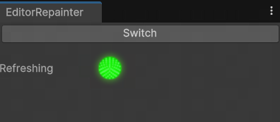

# Unity_Inspector_Repainter
[EN](README_EN.md)

强制每帧刷新所有Inspector的Unity小工具。

# 拟解决的问题

当Unity的性能开销比较大的时候，各Inspector的刷新机制会发生改变，很多数值的变化不会在Inspector面板实时刷新，这在我们需要观察数值变化以进行调试时非常头疼。

本工具启用期间，每5秒（可配置代码中的const字段）重新收集一次所有的Inspector面板，对于收集到的面板，每帧强制重绘更新它们。

# 用法

将本项目中的Editor文件夹放到你的Asset目录下、或者仅将Editor文件夹中的EditorRepainter.cs放置到你喜欢的任意Editor文件夹中，然后重编译。

从Unity顶端菜单中通过Tools/Inspector_Repainter打开工具面板，点击Switch按钮切换工作状态。

当面板绿灯亮起代表正在强制刷新中，灯不亮代表不管理Inspector。

 
