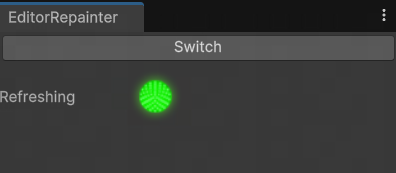

# Unity_Inspector_Repainter

A small Unity tool to forcefully refresh all Inspectors every frame.

# Problem Addressed

When Unity experiences high performance overhead, the refresh mechanisms of various Inspectors may change, leading to many values not updating in real-time on the Inspector panel. This can be frustrating when we need to observe value changes for debugging purposes.

While this tool is active, it will collect all Inspector panels every 5 seconds (configurable in the const field of the code) and forcefully repaint them every frame.

# Usage

Place the Editor folder from this project into your Asset directory, or simply place EditorRepainter.cs from the Editor folder into any preferred Editor folder, and then recompile.

Open the tool panel from the top menu in Unity via Tools/Inspector_Repainter and click the Switch button to toggle its working state.

When the panel's green light is on, it indicates that forced refreshing is active. When the light is off, it means Inspectors are not being managed.

 
